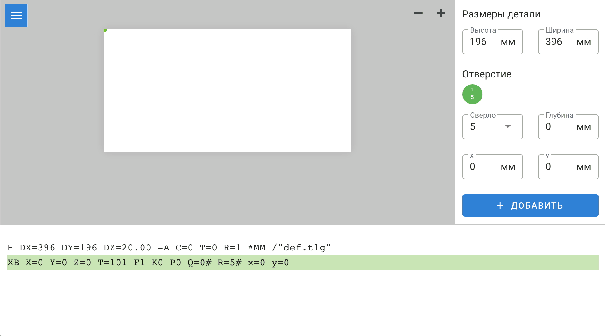

# Colander (alpha)

https://mukhin.dev/colander

Colander (с англ. – дуршлаг) – web-приложение позволяющие быстро подготовить G-code (управляющую программу) для сверловки на станке с ЧПУ от SCM (Xilog Plus). 

| :warning: Внимание! Раняя стария разработки (альфа-версия). Использование на свой страх и риск, без каких-либо гарантий со стороны автора. Лицензия ISC, ознакомтесь в файле `LICENSE.md`. |
| --- |

### Редактор

Ручная растановка отверстий, визуальная оценка и получение G-кода.

Принцип работы:
* Задаётся габарит детали
* Добавляются отверстия, с указанием типа сверла, положения по осям XY и глубине сверловки
* Предпросмотр для визуальной оценки
* Генерация G-кода

### Конвертер

Перевод команд одного формата в другой формат.

В настоящий момент работа сосредоточна на конвертере MPR в XXL, что позволит использовать программы созданные для станка KDT (Trepan) на станке SCM (Xilog Plus) после конвертирования. Пока речь только о сверловке (без фрезеровки).

## История изменений:

1.0 alpha2:
* Прототип текстового конвертера MPR (KDT, Trepan) -> XXL (SCM, Xilog Plus)

1.0 alpha1:
* Прототип векторного визуального 2D предпросмотра результата (на базе SVG графики)
* Прототип растановки лицевых отверстий, их визуальное отображение
* Прототип генерации G-кода

## Список дел:

[ ] Возможность перемещать отверстия мышью 
[ ] Торцевые отверстия 
[ ] Обработка ошибок в конвертере MPR -> XXL

Sergey Mukhin (mukhindev) 
https://mukhin.dev 
[VK @mukhindev](https://vk.com/mukhindev) 
[Telegram @mukhindev](https://t.me/mukhindev) 
